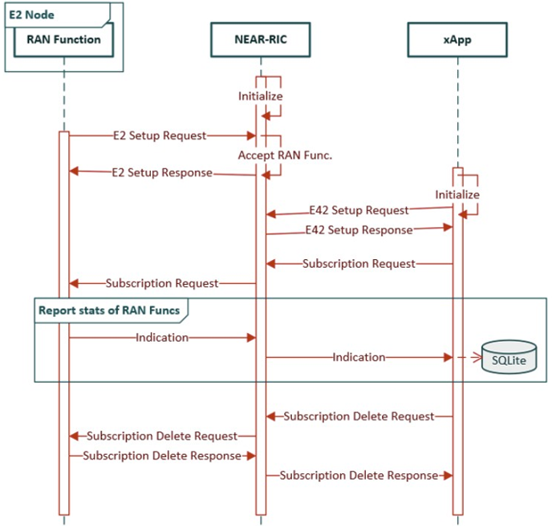

# Creating and Integrating a CPU KPM Metric in FlexRIC

## Contact

For help and information regarding this project, please contact: Dimitrios.Kefalas@lip6.fr

## **Overview**

In this project, you will design and implement a CPU Usage Key Performance Metric (KPM) to enhance computational resource monitoring in a 5G O-RAN environment. The work involves extending the existing FlexRIC KPM service model to include a new metric that captures the real-time CPU utilization of RAN nodes. This metric will be integrated into the network by updating the E2 nodes to support and periodically report CPU usage data. Furthermore, you will develop an xApp capable of subscribing to this new metric.

The deployment will utilize **Docker-Compose** for containerized 5G Core Network (CN) components, with the Radio Access Network (RAN) and FlexRIC deployed on bare metal for high performance and real-world testing.

---

## **Objectives**

1. **Create a Custom Metric:**  
   Define and implement a new Key Performance Metric (KPM) to monitor the CPU utilization of O-RAN nodes, using standard system monitoring tools / APIs.

2. **Extend the KPM Model:**  
   Modify the existing KPM service model in **FlexRIC** to incorporate the new metric, ensuring compatibility and integration.

3. **Update E2 Nodes:**  
   Configure E2 nodes to support and report the newly created metric to the FlexRIC controller.

4. **Develop an xApp:**  
   Build and deploy an **xApp** that subscribes to the new metric, processes the data, and takes actions based on the analysis.

5. **Test and Validate:**  
   Deploy the enhanced system in a FlexRIC environment to test and verify the accuracy and reliability of the new metric.

---

## **Tools & Software**

- **Docker-Compose:** For deploying containerized 5G Core Network (CN) components.
- **OpenAirInterface (OAI):** For implementing and testing the 5G RAN.
- **FlexRIC:** For extending the KPM service model and developing the xApp.
- **Bare-Metal Deployment:** For deploying the RAN and FlexRIC controller to ensure high performance in real-world scenarios.

Below are some useful information regarding the O-RAN architecture.

## O-RAN Architecture Principles

O-RAN, or Open Radio Access Network, is part of the broader initiative to evolve mobile networks through more open and flexible architectures. It aims to improve network efficiency and flexibility, enabling faster and more cost-effective deployment of new services. This is achieved by defining and standardizing interfaces that allow various vendors' equipment to operate seamlessly within the same network.


### The controllers:
The Near Real-Time Radio Intelligent Controller (realRT-RIC) is responsible for controlling and optimizing RAN functions. xApps are software applications that run on the Near-Real-Time RAN Intelligent Controller (Near-RT RIC). The Near-RT RIC is a critical component of the O-RAN architecture, designed to facilitate intelligent and efficient network management by hosting applications that can interact with the RAN elements in near-real-time. xApps play a pivotal role in enhancing the capabilities and performance of mobile networks through advanced data analytics and machine learning.
 The nonRT-RIC is part of SMO, centrally deployed in the service provider network, which enables non-real time (>1 second) control of RAN elements and their resources through specialized applications called rApps. The nonRT-RIC communicates with applications called xApps running on nearRT RIC to provide policy-based guidance. 

### O-RAN E2 Interface:
The E2 interface serves as a critical open interface between the near real-time RIC (nearRT-RIC) and E2 nodes, including Distributed Units (DU), Control Units for User Plane (CU-UP), Control Units for Control Plane (CU-CP) in 5G networks, and eNodeBs (eNB) in 4G networks. This interface empowers the nearRT-RIC to govern various procedures and functionalities within these E2 nodes. Additionally, the E2 interface facilitates the collection of metrics from the Radio Access Network (RAN) to the nearRT-RIC. This data collection can occur periodically or be triggered by predefined events. The E2 interface supports both control and data gathering processes that can interface with individual or multiple cells, network slices, Quality of Service (QoS) classes, or specific User Equipments (UEs). The E42 interface represents an enhancement over the E2, introducing five additional procedures: E42 Setup Request, E42 Setup Response, E42 Subscription Request, E42 Subscription Delete Request, and E42 RIC Control Request. These extensions further enhance the interface's capabilities to manage and optimize network performance effectively. In the following table we can see the O-RAN E2 Terminology.


| Component  | Definition                                                                                                                                                                       |
|------------|-----------------------------------------------------------------------------------------------------------------------------------------------------------------------------------|
| **E2**     | Interface RAN/near-RT RIC. It connects xApp to RAN functions.                                                                                                                     |
| **E2AP**   | The E2 Application Protocol (E2AP) specifies the signaling protocol between the Near-RT RIC and the E2 Node over the E2 interface providing management and service encapsulation. Services supported are Report, Control, Insert, Policy. |
| **E2 Node**| A logical node terminating E2 interface (e.g., eNB, CU, DU). It consists of: <br>- E2 Agent used to terminate the E2 interface and to forward/receive E2 messages. <br>- One or more RAN functions that are controlled by the Near-RT RIC, e.g., supporting Near-RT RIC Services. <br>- Other RAN functions that do not support Near-RT RIC Services. |
| **RAN Function** | Specific function in an E2 Node exposed by E2SM and that can be controlled by xApps.                                                                                                 |
| **E2SM**   | A service model describes the Services exposed by a specific RAN function within an E2 node over the E2 interface towards the Near-RT RIC.                                          |
| **RIC Service** | A Service provided on an E2 Node to provide access to messages and measurements and / or enable control of the E2 Node from the Near-RT RIC.                                         |
| **xApp**   | An application designed to run on the Near-RT RIC and used for monitoring and/or controlling RAN functions via E2SM.                                                                |

## FlexRIC

The design of FlexRIC is optimized for low-latency or resource-restricted scenarios, adhering to the zero-overhead principle to ensure minimal resource waste. It emphasizes flexibility and forward compatibility to accommodate emerging use cases through the use of both static and dynamic polymorphism. This approach allows for adaptable interfaces that can evolve over time without compromising existing functionalities. Additionally, Service Models (SMs) are implemented as shared objects, which significantly reduces coupling, enhancing modularity and ease of maintenance. For a more in-depth discussion and technical details, consider reviewing the "FlexRIC" paper [[^FlexRIC]]. By specifications, xApp is independent of the nearRT-RIC and may be provided by any third party. At the moment, xApp framework in FlexRIC does not allow third-party connectivity. 


### E2 in FlexRIC:

The E42 interface enhances the E2 interface by adding five additional procedures:
  - E42 Setup Request
  - E42 Setup Response
  - E42 Subscription Request
  - E42 Subscription Delete Request
  - E42 RIC Control Request

These procedures expand the capabilities of the interface to better manage and control network functions.

### Message Exchange in FlexRIC

1. **Initialization Phase**
   - **Initialize**: Both NEAR-RIC and xApp initialize their operations.

2. **Setup Phase**
   - **E2 Setup Request**: E2 Node to NEAR-RIC to initiate setup.
   - **E2 Setup Response**: NEAR-RIC to E2 Node acknowledging setup.
   - **Accept RAN Function**: NEAR-RIC accepts the RAN function.
   - **E42 Setup Request**: NEAR-RIC to xApp initiating E42 setup.
   - **E42 Setup Response**: xApp to NEAR-RIC acknowledging E42 setup.

3. **Subscription Phase**
   - **Subscription Request**: xApp to NEAR-RIC to E2 Node requesting subscription to RAN function reports and metrics.
   - **Report stats of RAN Funcs**: E2 Node to NEAR-RIC to xApp reporting RAN function statistics, stored in SQLite.

4. **Indication Phase**
   - **Indication**: E2 Node to NEAR-RIC to xApp sending real-time data and performance metrics, stored in SQLite.

5. **Subscription Deletion Phase**
   - **Subscription Delete Request**: xApp to NEAR-RIC to E2 Node requesting subscription termination.
   - **Subscription Delete Response**: E2 Node to NEAR-RIC to xApp confirming subscription deletion.





**E2SM architecture in FlexRIC**

Service Models (SMs) are defined sets of operations, metrics, and data structures that specify how RAN functions can be controlled and monitored. They standardize the way different RAN functions interact with the RIC and xApps, ensuring consistency and interoperability. In the flexRIC some of these Service Models support multi-language some others not. Here's the overview:

| SM Supported | C-binding | Python binding |
|--------------|-----------|----------------|
| SLICE        | YES       | YES            |
| TC           | YES       | NO             |
| NG/GTP       | YES       | YES            |
| PDCP         | YES       | YES            |
| RLC          | YES       | YES            |
| MAC          | YES       | YES            |
| KPM          | YES       | NO             |
| RC           | YES       | NO             |


Service Models are designed as plug-ins (shared dynamic libraries). Service Models need to be loaded in the nearRT-RIC, as well as in the E2 agent.


# 1. Instalation & 2. Deployment

## 2.1 OAI RAN
From lab8 you have already been given with instructions on how to run the OAI 5G RAN and UE alongside with the flexric execution.

# 2. Deployment

## 2.1 OAI RAN

### 2.1.1 Clone the OAI repository
  ```bash
  git clone https://gitlab.eurecom.fr/oai/openairinterface5g oai
  cd oai/
  ```

### 2.1.2 Build OAI with E2 Agent

  - By default, OAI will build the E2 Agent with E2AP v2 and KPM v2. If you want a different version, edit the variable E2AP\_VERSION and KPM\_VERSION at OAI's CMakeLists.txt file.

  Currently available versions:
  |            |KPM v2.03|KPM v3.00|
  |:-----------|:--------|:--------|
  | E2AP v1.01 | Y       | Y       |
  | E2AP v2.03 | Y       | Y       |
  | E2AP v3.01 | Y       | Y       |

  Please note that KPM SM v2.01 is supported only in FlexRIC, but not in OAI.

  ```bash
  cd cmake_targets/
  ./build_oai -I -w SIMU --gNB --nrUE --build-e2 --ninja
  ```

  * `-I` option is to install pre-requisites, you only need it the first time you build the softmodem or when some oai dependencies have changed.
  * `-w` option is to select the radio head support you want to include in your build. Radio head support is provided via a shared library, which is called the "oai device" The build script creates a soft link from `liboai_device.so` to the true device which will be used at run-time (here the USRP one, liboai_usrpdevif.so). The RF simulatorRF simulator is implemented as a specific device replacing RF hardware, it can be specifically built using `-w SIMU` option, but is also built during any softmodem build.
  * `--gNB` is to build the `nr-softmodem` and `nr-cuup` executables and all required shared libraries
  * `--nrUE` is to build the `nr-uesoftmodem` executable and all required shared libraries
  * `--ninja` is to use the ninja build tool, which speeds up compilation
  * `--build-e2` option is to use the E2 agent, integrated within RAN.

  If the openair2/E2AP/flexric folder is empty, try manually the following commands:
  ```bash
  git submodule init
  git submodule update
  ```

## 2.2 FlexRIC

By default, FlexRIC will build the nearRT-RIC with E2AP v2 and KPM v2. If you want a different version, edit the variable E2AP\_VERSION and KPM\_VERSION at FlexRIC's CMakeLists.txt file. Note that OAI's and FlexRIC's E2AP\_VERSION and KPM\_VERSION need to match due to O-RAN incompatibilities among versions.


### 2.2.1 Clone the FlexRIC repository
  ```bash
  git clone https://gitlab.eurecom.fr/mosaic5g/flexric flexric
  cd flexric/
  git checkout f1c08ed2b9b1eceeda7941dd7bf435db0168dd56
  ```

### 2.2.2 Build FlexRIC
  If you have installed optional libraries from section [1.2.2 Multi-language xApp requirements (optional)](#122-multi-language-xapp-requirements-optional), run this command:
  ```bash
  mkdir build && cd build && cmake .. && make -j8
  ```
  otherwise:
  ```bash
  mkdir build && cd build && cmake -DXAPP_MULTILANGUAGE=OFF .. && make -j8
  ```

### 2.2.3 Installation of Service Models (SMs)
  ```bash
  sudo make install
  ```

  By default the service model libraries will be installed in the path `/usr/local/lib/flexric` while the configuration file in `/usr/local/etc/flexric`.


# 3. Service Models available in OAI RAN

## 3.1 O-RAN

We assume that user is familiar with O-RAN WG3 specifications that can be found at https://orandownloadsweb.azurewebsites.net/specifications.

For Spring-of-Code purpose, the following specifications are important:
- O-RAN.WG3.E2GAP-v02.00 - nearRT-RIC architecture & E2 General Aspects and Principles
- O-RAN.WG3.E2AP-v02.03 - E2AP protocol description
- O-RAN.WG3.E2SM-KPM-v02.03 - KPM Service Model description
- O-RAN.WG3.E2SM-RC-v01.03 - RAN Control Service Model description

### 3.1.1 E2SM-KPM

  As mentioned in section [2.1.2 Build OAI with E2 Agent](#212-build-oai-with-e2-agent), we support KPM v2.03/v3.00. Uses ASN.1 encoding.

  Per O-RAN specifications, 5G measurements supported by KPM are specified in 3GPP TS 28.552.

  From 3GPP TS 28.552, at the moment, we support the following list:
  * "DRB.PdcpSduVolumeDL"
  * "DRB.PdcpSduVolumeUL"
  * "DRB.RlcSduDelayDl"
  * "DRB.UEThpDl"
  * "DRB.UEThpUl"
  * "RRU.PrbTotDl"
  * "RRU.PrbTotUl"

  From O-RAN.WG3.E2SM-KPM-version specification, we implemented:
  * REPORT Service Style 4 ("Common condition-based, UE-level" - section 7.4.5) - fetch above measurements per each UE that matches common criteria (e.g. S-NSSAI).

### 3.1.2 E2SM-RC

  We support RC v1.03. Uses ASN.1 encoding.

  From ORAN.WG3.E2SM-RC-v01.03 specification, we implemented:
  * REPORT Service Style 4 ("UE Information" - section 7.4.5) - aperiodic subscription for "UE RRC State Change"
  * CONTROL Service Style 1 ("Radio Bearer Control" - section 7.6.2) - "QoS flow mapping configuration" (e.g creating a new DRB)

## 3.2 Custom Service Models

In addition, we support custom Service Models, such are MAC, RLC, PDCP, and GTP. Use plain encoding.

If you are interested in TC and SLICE SMs, please follow the instructions at https://gitlab.eurecom.fr/mosaic5g/flexric.

# 4. Start the process

## 4.1 Test with OAI RAN

  At this point, we assume the 5G Core Network is already running in the background. Please follow CN tutorial https://gitlab.eurecom.fr/oai/trainings/slices-summerschool/-/blob/main/cn/README.md?ref_type=heads for more information.

  In order to configure E2 agent, please, add the following block in OAI's configuration file (gnb.conf, du.conf, cu.conf,...):
  ```bash
  e2_agent = {
    near_ric_ip_addr = "127.0.0.1";
    sm_dir = "/usr/local/lib/flexric/"
  }
  ```

* start E2 Node agents

  As per O-RAN.WG3.E2SM-v02.00 specifications, UE ID (section 6.2.2.6) representation in OAI is following (ran_e2sm_ue_id.c):
  |                       | gNB-mono        | CU              | CU-CP           | CU-UP                 | DU                 |
  |:----------------------|:----------------|:----------------|:----------------|:----------------------|:-------------------|
  | CHOICE UE ID case     | GNB_UE_ID_E2SM  | GNB_UE_ID_E2SM  | GNB_UE_ID_E2SM  | GNB_CU_UP_UE_ID_E2SM  | GNB_DU_UE_ID_E2SM  |
  | AMF UE NGAP ID        | amf_ue_ngap_id  | amf_ue_ngap_id  | amf_ue_ngap_id  |                       |                    |
  | GUAMI                 | guami           | guami           | guami           |                       |                    |
  | gNB-CU UE F1AP ID     |                 | rrc_ue_id       |                 |                       | rrc_ue_id          |
  | gNB-CU-CP UE E1AP ID  |                 |                 | rrc_ue_id       | rrc_ue_id             |                    |
  | RAN UE ID             | rrc_ue_id       | rrc_ue_id       | rrc_ue_id       | rrc_ue_id             | rrc_ue_id          |

  * start the gNB-mono
    ```bash
    cd oai/cmake_targets/ran_build/build
    sudo ./nr-softmodem -O <path-to/slices-summerschool/conf/gnb.sa.band78.fr1.106PRB.usrpb210.conf> --rfsim --sa -E
    ```

* start the nrUE
  ```bash
  cd oai/cmake_targets/ran_build/build
  sudo ./nr-uesoftmodem -r 106 --numerology 1 --band 78 -C 3619200000 --rfsim --sa -O <path-to/slices-summerschool/conf/ue.conf> -E
  ```


Run Wireshark and capture E2AP traffic. Per O-RAN.WG3.E2GAP-v02.00 specifications, no SCTP port is specified for E2AP protocol. In FlexRIC implementation, they use port number 36421.


* start the nearRT-RIC
  ```bash
  cd flexric
  ./build/examples/ric/nearRT-RIC
  ```

Check that you see the E2 Setup Request and Response messages in Wireshark. 
Within E2 Setup Request message, E2 node sends his own capabilities, such are KPM and RC supported RAN Functions.


* Start iperf3 traffic
  * get UE IP address and open server port
    ```bash
    ifconfig  # get UE IP address on interface oaitun_ue1
    iperf3 -i1 -s
    ```

  * start DL traffic from traffic container `oai-ext-dn` within CN
    ```bash
    docker exec -t oai-ext-dn iperf3 -c <UE-IP-address> -t60 -B 192.168.70.135 -i1
    ```
    Note: for the UL traffic, add option `-R`


* Start different xApps

  * start the KPM monitor xApp - measurements stated in [3.1.1 E2SM-KPM](#311-e2sm-kpm) for each UE that matches S-NSSAI common criteria
    ```bash
    cd flexric
    ./build/examples/xApp/c/monitor/xapp_kpm_moni
    ```
    Note: we assume that each UE has only 1 DRB; CU-UP does not store the slices, therefore "coarse filtering" is used

  * start the RC monitor xApp - aperiodic subscription for "UE RRC State Change"
    ```bash
    cd flexric
    ./build/examples/xApp/c/monitor/xapp_rc_moni
    ```

  * start the RC control xApp - RAN control function "QoS flow mapping configuration" (e.g. creating a new DRB)
    ```bash
    cd flexric
    ./build/examples/xApp/c/kpm_rc/xapp_kpm_rc
    ```
The output should look something like this:

```
UE ID type = gNB, amf_ue_ngap_id = 1
ran_ue_id = 1
DRB.PdcpSduVolumeDL = 79 [kb]
DRB.PdcpSduVolumeUL = 80 [kb]
DRB.RlcSduDelayDl = 37.27 [μs]
DRB.UEThpDl = 88.32 [kbps]
DRB.UEThpUl = 97.43 [kbps]
RRU.PrbTotDl = 1170 [PRBs]
RRU.PrbTotUl = 2237 [PRBs]
```

This xapp monitors some Key Perfomance Measurments in the RAN. The measurments of this xapps are described below:

- **DRB.PdcpSduVolumeDL (Downlink PDCP SDU Volume):**

This measures the total volume of Service Data Units (SDUs) processed by the Packet Data Convergence Protocol (PDCP) layer in the downlink direction (from the network to the user equipment).


- **DRB.PdcpSduVolumeUL (Uplink PDCP SDU Volume):**

This measures the total volume of SDUs processed by the PDCP layer in the uplink direction (from the user equipment to the network).

- **DRB.RlcSduDelayDl (Downlink RLC SDU Delay):**

This measures the delay experienced by SDUs at the Radio Link Control (RLC) layer in the downlink direction. It indicates how long it takes for data packets to be processed and transmitted by the RLC layer to the user equipment.

- **DRB.UEThpDl (Downlink User Equipment Throughput):**

This measures the throughput achieved by the user equipment in the downlink direction. It indicates the rate at which data is successfully received by the user equipment from the network.

- **DRB.UEThpUl (Uplink User Equipment Throughput):**

This measures the throughput achieved by the user equipment in the uplink direction. It indicates the rate at which data is successfully sent by the user equipment to the network.

- **RRU.PrbTotDl (Total Downlink Physical Resource Block Usage):**

This measures the total usage of physical resource blocks (PRBs) in the downlink direction. PRBs are the smallest units of resources that can be allocated for transmission in LTE and 5G networks. This metric indicates the extent of resource utilization in the downlink.
RRU.PrbTotUl (Total Uplink Physical Resource Block Usage):

This measures the total usage of PRBs in the uplink direction. Similar to the downlink PRB usage, this metric indicates the extent of resource utilization in the uplink.

  * start the (MAC + RLC + PDCP + GTP) monitor xApp
    ```bash
    cd flexric
    ./build/examples/xApp/c/monitor/xapp_gtp_mac_rlc_pdcp_moni
    ```
The latency that you observe in your monitor xApp is the latency from the E2 Agent to the nearRT-RIC and xApp. 
Therefore, FlexRIC is well suited for use cases with ultra low-latency requirements.
Additionally, all the data received in the `xapp_gtp_mac_rlc_pdcp_moni` xApp is also written to /tmp/xapp_db in case that offline data processing is wanted (e.g., Machine Learning/Artificial Intelligence applications). You can browse the data using e.g., sqlitebrowser.
Please note:
* KPM SM database is not been updated, therefore commented in `flexric/src/xApp/db/sqlite3/sqlite3_wrapper.c:1152`
* RC SM database is not yet implemented.

## 4.3 Mapping between emulator and RAN E2 agent code

  |                                                     | Emulator           | OAI E2 agent         |
  |:----------------------------------------------------|:-------------------|:---------------------|
  | E2 Setup Request (E2 node Component Configuration)  | read_setup_ran.c   | read_setup_ran.c     |
  | E2 Setup Request (RAN Functions added)              | test_agent.c       | init_ran_func.c      |
  | general KPM SM source file                          | sm_kpm.c           | ran_func_kpm.c       |
  | KPM SM REPORT Service                               |                    | ran_func_kpm_subs.c  |


## 5.1 KPM SM
### 5.1.1 Pick interesting measurements
Pick a measurement that seems interesting to you. You might want to consult
[3GPP TS
28.552](https://www.etsi.org/deliver/etsi_ts/128500_128599/128552/16.17.00_60/ts_128552v161700p.pdf)
for more information.


### 5.1.2 Implement in the RAN Function
Reuse the xApp code and request the measurement from the RAN. For the moment,
keep it simple by implementing it in the RAN function by exporting random
numbers.  Basically, you will be able to see e.g. PDCP statistics for the UE,
as in the training, and your measurement will show still as a random number,
next to it, but exported from the RAN.


## Αll you need to do is to :
As described in lab8:
1) Access the VM
2) Go sudo: `sudo bash`
4) Start the core: 
5) Start the flexric:
6) Start the OAI-gNB
7) Start the UE
8) Run the xapp:


8) To modify the code and add a new measurment:

Get Familiar with kpm xapp – Run the example xapp
` flexric/examples/xApp/c/monitoring/xapp_kpm_moni.c`

Get Familiar with KPM SM in OAI
`openairinterface/openair2/E2AP/RAN_FUNCTION-ORAN/`

Get Familiar with the measurements
`openairinterface/openair2/E2AP/RAN_FUNCTION-ORAN/ran_func_kpm_subs.c`

Create a measurement:
Modify: `ran_func_kpm_subs.c, ran_func_kpm.c and the xapp_kpm_moni.c `

9) Modify the code and when you're ready to test, rebuild both oai and flexric.

# **Project Goals**

1. **Design a Custom Performance Metric:**  
   Develop a new Key Performance Metric (KPM) specifically designed to monitor CPU usage in O-RAN nodes. You may utilize traditional system monitoring tools (e.g., top, mpstat, psutil, etc.) to collect and process CPU utilization data. You are also able to provide additional KPMs such as bit per CPU usage, etc.

2. **Extend the KPM Service Model:**  
   Modify and extend the FlexRIC KPM service model to include the new metric, ensuring seamless integration and compatibility.

3. **Enable Metric Reporting in E2 Nodes:**  
   Update E2 nodes to support the newly designed metric, ensuring they can report relevant data to the FlexRIC controller.

4. **Develop a Functional xApp:**  
   Build an xApp capable of subscribing to the new metric, processing the data, and taking proactive actions to enhance network performance.

5. **Deploy and Validate the System:**  
   Deploy the updated system, including the extended KPM model and the xApp, in a FlexRIC-enabled environment. Validate the metric’s accuracy, reliability, and its impact on network optimization.


